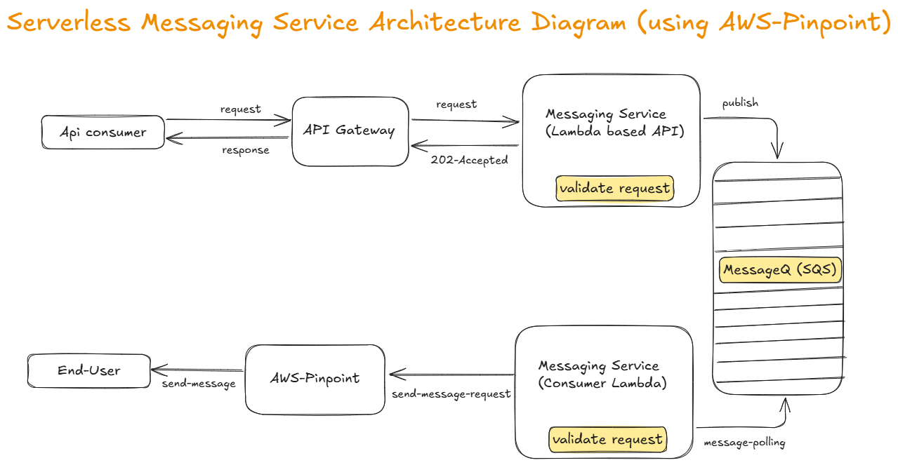

# System-designs 
- **A collection of my recent system design work, showcasing scalable architecture, design patterns, and best practices.**

## 1) `Serverless Messaging Service` Architecture

This architecture diagram illustrates a serverless messaging service flow built on AWS components:

- **API Consumer**: Initiates requests to the system.
- **API Gateway**: Handles and routes inbound API requests.
- **Messaging Service (Lambda-based API)**: Validates requests and publishes messages to a queue.
- **MessageQ (SQS)**: Provides reliable message queuing.
- **Messaging Service (Consumer Lambda)**: Polls the queue, processes messages, and triggers downstream actions.
- **AWS Pinpoint**: Sends messages to end-users (such as SMS, email, or push notifications).
- **End-User**: Receives the final communication.

**Workflow Overview**:
1. The API Consumer sends a request via the API Gateway.
2. The Lambda-based messaging API validates and accepts the request, placing a message in the SQS queue.
3. The Consumer Lambda polls SQS, processes the message, and interacts with AWS Pinpoint.
4. AWS Pinpoint sends the message to the intended end-user.

This design leverages AWS managed services to achieve scalability, decoupling, and cost efficiency with minimal server management.

---

## 2) `hotel-search-api` system design overview

This system design outlines the high-level architecture for a hotel search and booking platform. The core concept leverages major **Hotel Aggregators** (also known as Bedbanks or large OTAs) to consolidate hotel inventory from numerous sources, rather than connecting directly to every individual hotel system or channel manager.

### Sequence Diagram

### System Components

- **User (OTA Website)**:	The front-end application (your website or app) where end-users search for hotels and make bookings.
- **Hotel Search API (Your Site)**:	Your back-end service responsible for handling user requests, querying the Hotel Aggregator API, processing results, and managing the booking flow.
- **Hotel Aggregator Network**:	A third-party B2B service (e.g., Hotelbeds, Expedia Partner Solutions) that aggregates hotel data from thousands of sources into a single API endpoint. This is the primary data source for your system.
- **Channel Manager (CM)**:	Software used by hotels to manage their inventory and pricing across multiple Online Travel Agencies (OTAs) simultaneously. The CM uses industry standards (like OpenTravel XML) to sync data in real-time.
- **Hotel PMS (Property Management System)**:	The internal software system used by hotels to manage all internal operations, including reservations, check-ins, billing, and room availability.
